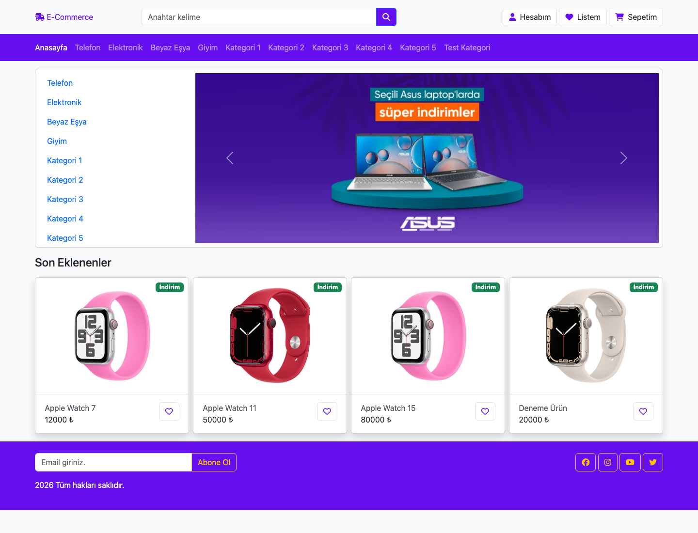
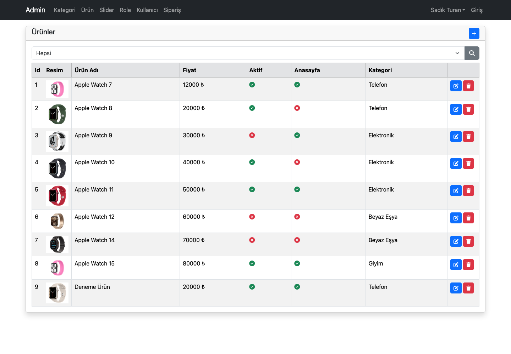
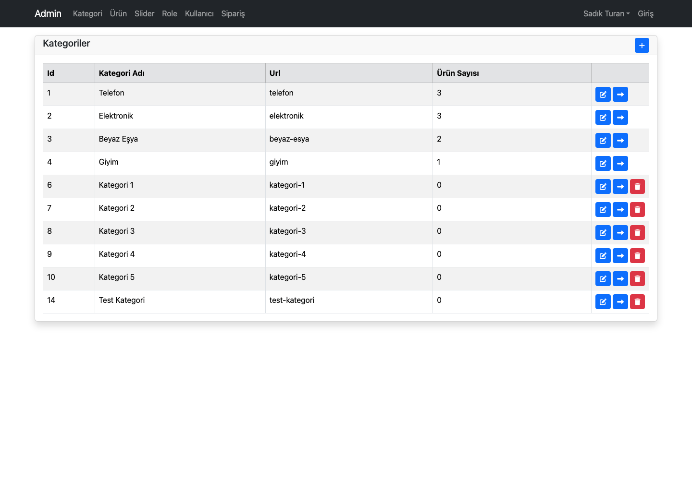
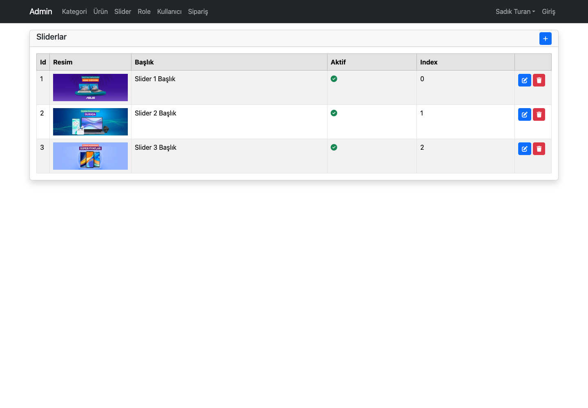
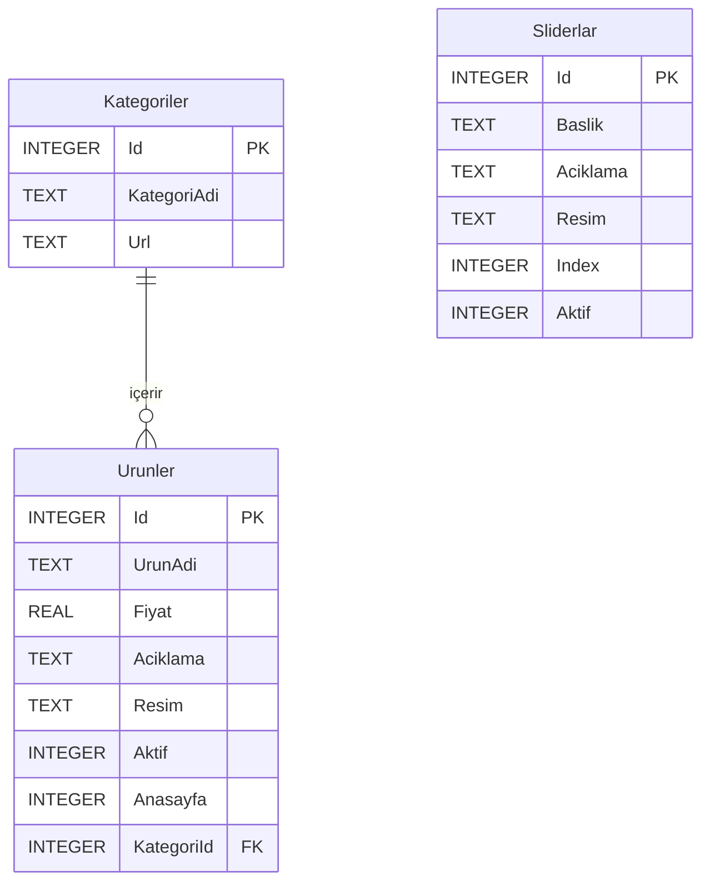

# E-Commerce CMS · ASP.NET Core MVC

C# ve ASP.NET Core MVC ile geliştirilmiş, **ürün kataloğu ve içerik yönetim panelini (CMS)** bir araya getiren web uygulaması. Ürünler, kategoriler ve ana sayfa slider içerikleri yönetim ekranlarından düzenlenir; veriler **Entity Framework Core üzerinden SQLite ilişkisel veritabanında** saklanır.


[csharp](https://github.com/topics/csharp "Topic: csharp") · [aspnet-core](https://github.com/topics/aspnet-core "Topic: aspnet-core") · [dotnet](https://github.com/topics/dotnet "Topic: dotnet") · [mvc](https://github.com/topics/mvc "Topic: mvc") · [cms](https://github.com/topics/cms "Topic: cms") · [ecommerce](https://github.com/topics/ecommerce "Topic: ecommerce") · [entity-framework-core](https://github.com/topics/entity-framework-core "Topic: entity-framework-core") · [sqlite](https://github.com/topics/sqlite "Topic: sqlite") · [sql](https://github.com/topics/sql "Topic: sql") · [razor](https://github.com/topics/razor "Topic: razor") · [bootstrap](https://github.com/topics/bootstrap "Topic: bootstrap") · [code-first](https://github.com/topics/code-first "Topic: code-first") · [crud](https://github.com/topics/crud "Topic: crud") · [turkish](https://github.com/topics/turkish "Topic: turkish")

## CMS özellikleri

| Modül | İşlevler |
| --- | --- |
| Ürün yönetimi | Ürün ekleme, listeleme, düzenleme ve silme; fiyat, açıklama, kategori ve görsel yönetimi |
| Yayın kontrolü | Ürünün aktiflik ve ana sayfada gösterim durumunu düzenleme |
| Kategori yönetimi | Kategori adı ve URL alanını yönetme; kategoriye bağlı ürün sayısını görüntüleme |
| Slider yönetimi | Görsel yükleme, başlık ve açıklama düzenleme, aktiflik ve sıralama kontrolü |
| Katalog | Aktif ürünleri listeleme, kategori URL'siyle filtreleme ve ürün adına göre arama |
| Ürün detayları | Ürün bilgileri ve aynı kategoriden en fazla dört aktif benzer ürün |

Formlarda model doğrulama, düzenleme/silme sonrasında bildirimler ve ürün yönetiminde kategori filtresi bulunur. Yüklenen görseller `wwwroot/img` altında, dosya adları veritabanında tutulur.

## Ekran görüntüleri

Görseller, uygulamanın yerel ortamda mevcut örnek verilerle çalıştırılmasından alınmıştır. Kurulumdaki veriler değiştikçe ekran içerikleri de değişebilir.

### Mağaza vitrini



### CMS · Ürün yönetimi



### CMS · Kategori yönetimi



### CMS · Slider yönetimi



## Teknoloji ve mimari

| Katman | Kullanılan yapı |
| --- | --- |
| Sunucu | C#, .NET 10, ASP.NET Core MVC |
| Veri erişimi | Entity Framework Core 10.0.12, LINQ, Code First migrations |
| SQL veritabanı | SQLite — `store.db` |
| Arayüz | Razor Views (`.cshtml`), Bootstrap 5.3.3, Font Awesome, jQuery |
| Tekrar kullanılabilir arayüz | Layout, partial view ve kategori menüsü/slider için ViewComponent |

İstekler controller'larda karşılanır; `DataContext` üzerinden veriler sorgulanır ve Razor görünümlerine aktarılır. Oluşturma, düzenleme ve listeleme işlemleri için ayrı model sınıfları kullanılır.

```text
Controllers/       Ürün, kategori, slider, mağaza ve yönetim işlemleri
Models/            Entity sınıfları, form/liste modelleri ve DataContext
Migrations/        Veritabanı şeması ve örnek veri değişiklikleri
ViewComponents/    Kategori menüsü ve slider bileşenleri
Views/             Mağaza ve CMS Razor sayfaları
wwwroot/           CSS, JavaScript, ürün ve slider görselleri
```

## SQL ve veritabanı yapısı

Proje SQL tabanlı ilişkisel veri saklama için **SQLite** kullanır. Mevcut sağlayıcı `Microsoft.EntityFrameworkCore.Sqlite`, bağlantı yapılandırması ise `Program.cs` içindeki `UseSqlite` çağrısıdır. SQL Server kurulumu gerekmez.



- Bir kategori birden fazla ürüne sahiptir; her ürün `KategoriId` ile bir kategoriye bağlanır.
- `Urunler.KategoriId` üzerinde foreign key ve `IX_Urunler_KategoriId` indeksi bulunur.
- İlişki `ON DELETE CASCADE` olarak tanımlıdır: kategori silindiğinde bağlı ürün kayıtları da silinir.
- Boolean alanlar SQLite'ta `INTEGER` (`0`/`1`), C# `double` türündeki fiyat alanı `REAL` olarak saklanır.
- `Sliderlar` bağımsız içerik tablosudur; `Index` gösterim sırasını tutar.
- `HasData` ile tanımlanan başlangıç verileri migration'larla yüklenir. Uygulanan migration'lar `__EFMigrationsHistory` tablosunda izlenir.

Uygulama sorguları LINQ ile yazılır; EF Core bunları SQL'e çevirir. Veritabanını doğrudan incelemek için örnek sorgular:

```sql
-- Ana sayfada gösterilen aktif ürünler ve kategorileri
SELECT u.Id, u.UrunAdi, u.Fiyat, k.KategoriAdi
FROM Urunler AS u
JOIN Kategoriler AS k ON k.Id = u.KategoriId
WHERE u.Aktif = 1 AND u.Anasayfa = 1;

-- Ürünü olmayan kategoriler dahil kategori başına ürün sayısı
SELECT k.Id, k.KategoriAdi, COUNT(u.Id) AS UrunSayisi
FROM Kategoriler AS k
LEFT JOIN Urunler AS u ON u.KategoriId = k.Id
GROUP BY k.Id, k.KategoriAdi;

-- Aktif slider içeriklerinin gösterim sırası
SELECT Id, Baslik, Resim, "Index"
FROM Sliderlar
WHERE Aktif = 1
ORDER BY "Index";
```

## Yerel kurulum

Gereksinimler: **.NET 10 SDK**, Git ve NuGet/CDN kaynaklarına internet erişimi. Bootstrap, Font Awesome ve jQuery sayfalarda CDN üzerinden yüklenir.

```bash
git clone https://github.com/seyitbugraerden/e-commerce-dotnet-core.git
cd e-commerce-dotnet-core
dotnet restore
dotnet tool restore --tool-manifest dotnet-tools.json
```

`appsettings.json` içindeki varsayılan bağlantı:

```json
{
  "ConnectionStrings": {
    "DefaultConnection": "Data Source=store.db"
  }
}
```

Proje kök dizininde migration'ları uygulayıp uygulamayı başlatın:

```bash
dotnet ef database update
dotnet run --no-launch-profile --urls http://localhost:5188
```

Migration komutu mevcut veritabanına eksik migration'ları uygular; veritabanı yoksa oluşturur. Uygulama başlangıcında otomatik migration çalıştırılmaz.

| Ekran | Adres |
| --- | --- |
| Mağaza | `http://localhost:5188/` |
| Ürün kataloğu | `http://localhost:5188/urunler` |
| Kategori filtresi | `http://localhost:5188/urunler/telefon` |
| Ürün arama | `http://localhost:5188/urunler?q=watch` |
| Yönetim ana sayfası | `http://localhost:5188/Admin` |
| Ürün yönetimi | `http://localhost:5188/Urun` |
| Kategori yönetimi | `http://localhost:5188/Kategori` |
| Slider yönetimi | `http://localhost:5188/Slider` |

Model değişikliklerinden sonra migration oluşturmak ve SQL çıktısını incelemek için:

```bash
dotnet ef migrations add DegisiklikAdi
dotnet ef migrations script --output migration.sql
dotnet ef database update
```

## Mevcut kapsam

Bu proje ürün kataloğu ve CMS geliştirme örneğidir. Yönetim panelindeki satış/sipariş kartları ve sipariş listesi statik örnek içeriklerdir. Sepet, ödeme ve sipariş işleme akışı uygulanmamıştır; `wwwroot/e-commerce` altındaki HTML dosyaları arayüz şablonlarıdır.

Yönetim işlemleri için kullanıcı girişi ve rol tabanlı erişim kontrolü henüz uygulanmamıştır. Üretim ortamına geçiş için yönetim uçlarının yetkilendirilmesi gerekir.
